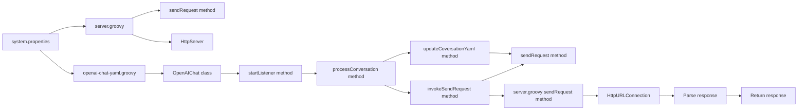

# public openai-chat repo
This is an experimental groovy/file based chat client with openai api meant for use with visual studio live code share.
*Live streaming of responses is not supported*

# Prerequisites
- An internet connection
- OpenAI API key

# Diagram (From AI Interpretation)


# Running client and server together
bash:
```bash
export token='myOpenAIToken' port=9001
groovy main.groovy $port $token
```
Windows command prompt:  
```batch
set token=myOpenAIToken && set port=9001
groovy main.groovy %port% %token%
```

# Single Codespace startup command (Server only)
```bash
export token='myOpenAIToken' port=9001 &&  curl -Ls https://sh.jbang.dev | bash -s - app setup && source ~/.bashrc && git clone https://github.com/automationStati0n/openai-groovy-yaml-chat && cd openai-groovy-yaml-chat && jbang jbang_main_v2_JAVA11.java server.groovy $port $token
```

# Running the client
**Port defaults to 9001 if not specified**
bash:
```bash
export port=9001
groovy openai-chat-yaml.groovy $port
```
Windows command prompt:  
```batch
set port=9001
groovy openai-chat-yaml.groovy %port%
```

# Extras
## Use jbang to run groovy
1. get jbang  
   ```bash
   curl -Ls https://sh.jbang.dev | bash -s - app setup
   ```
2. follow https://github.com/automationStati0n/jbang-groovy-launcher/tree/main  
   ```bash
   jbang https://gist.github.com/automationStati0n/d8d28cfb7a68592c79fd052419597e04 openai-chat-yaml.groovy $token
   ```

## Quickstart with main.groovy
- You can put your openai API key in a file called `key` (added to .gitignore but ensure it's not pushed to git - *Not recommended*)
- If you don't specify a port, `9001` is used by default when using `key` file

## system.properties
You can edit this file to your liking, the purpose is to provide a quick selection to different prompts based on your needs. Restart the client for changes to take effect.